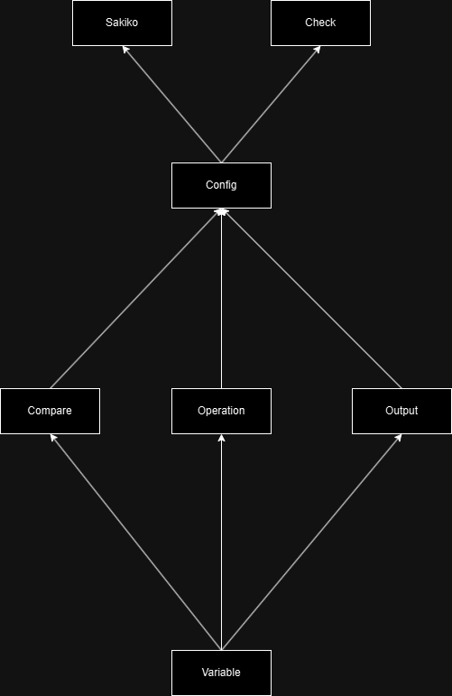

# Sakiko 开发文档

本文档包含了 Sakiko 项目的开发文档，包括了项目的整体设计、各个模块的详细设计、测试方法等内容。

## 1. 项目架构

由变量、比较、操作、输出、配置、会话、检测等模块组成。

变量模块提供了基础定义，比较、操作、输出模块提供了对变量的操作，配置模块提供了配置文件的读写以及对前面模块的整合，会话模块提供了会话的状态和上下文以及用户接口，检测模块提供了对配置文件的检测。

## 2. 变量模块 `variable.rs`

变量模块提供了对变量的定义和一些检测方法。

有以下结构体或枚举：

- `VariableType`：变量类型枚举，包括整形、浮点型、字符串、数组和哈希表，枚举包含数据本身。
- `Variables`：元组结构体，包含了一个哈希表，用于存储变量。

提供了类型检测、格式化等方法。

包含测试桩。

具体各接口和类的设计请参考源码和注释。

## 3. 比较模块 `compare.rs`

比较模块提供了对变量的比较操作以及比较类的封装、检测和计算实现。

有以下结构体或枚举：

- `CompareType`：比较类型枚举，包括等于、不等于、大于、小于、大于等于、小于等于、与、或。
- `Compare`：元组结构体，包含了两个状态`And`和`Or`，用于存储比较类型最终的计算方式。
- `CompareItem`：结构体、封装 `CompareType` 和 `VariableType`，用于存储比较的两个变量。
- `Compares`：元组结构体，包含了一个数组，用于存储 `CompareItem`。

提供了比较计算以及错误检测的接口。

包含测试桩。

具体各接口和类的设计请参考源码和注释。

## 4. 操作模块 `operation.rs`

操作模块提供了对变量的操作，以及对操作的封装、检测和计算实现。

有以下结构体或枚举：

- `Operation`：操作枚举，包括赋值、加法、减法、乘法、除法、获取数组元素、数组元素赋值、获取哈希表元素、哈希表元素赋值、变量赋值、复制、随机函数、数组随机函数。
- `Operations`：元组结构体，包含了一个数组，用于存储 `Operation`。

提供了操作计算以及类型错误检测的接口。

包含测试桩。

具体各接口和类的设计请参考源码和注释。

## 5. 输出模块 `output.rs`

输出模块提供了对变量的输出，以及对输出类的封装、检测和格式化实现。

有以下结构体或枚举：

- `Output`：输出枚举，包括格式化字符串、变量名数组。

提供了输出格式化以及错误检测的接口。

包含测试桩。

具体各接口和类的设计请参考源码和注释。

## 6. 配置模块 `config.rs`

配置模块提供了对配置文件的读写，以及对配置每部分类的实现。

有以下结构体或枚举：

- `Transaction`：转移结构体，包含了匹配字符串、比较、下一步、操作
- `Step`：步骤结构体，包含用户输出、转移数组
- `SakikoConfig`：配置结构体，包含了机器人名、开始步骤、变量、步骤数组

给用户使用的接口详见 [API 接口](./API.md)

其余包含一些构建测试用配置的方法。

包含测试桩。

具体各接口和类的设计请参考源码和注释。

## 7. 会话模块 `sakiko.rs`

会话模块提供了对会话的状态和上下文的封装，以及会话的操作。

该模块详见 [API 接口](./API.md)

## 8. 检测模块 `checker.rs`

检测模块提供了对配置文件的检测，以及对配置文件的检测方法。

该模块详见 [API 接口](./API.md)

## 9. 测试桩

测试桩提供了对各个模块的测试方法。

包括格式化、计算、错误机制是否正常工作的测试。

### 使用方法

在项目根目录下运行 `cargo test` 即可运行所有测试。